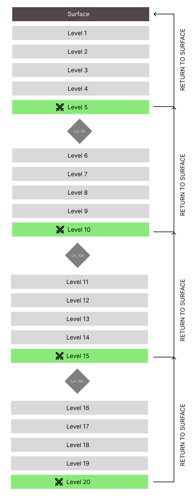

---
layout:
  title:
    visible: true
  description:
    visible: false
  tableOfContents:
    visible: true
  outline:
    visible: true
  pagination:
    visible: true
---

# 🎮 Jugabilidad

En las profundidades del abismo, aguarda un desafío singular para los valientes que osen adentrarse en sus sombrías extensiones. Compuesto por una sucesión descendente de veinte niveles, este vasto dominio subterráneo presenta una serie de cámaras generadas de forma procedural, cada una con sus propios peligros y desafíos únicos.

Esta travesía, permeada de riesgos y recompensas, pone a prueba la valentía y la resolución de los aventureros, desafiándolos a superar las adversidades en busca de los misterios más profundos que el abismo guarda celosamente. ¿Te atreverás a enfrentar este desafío sin igual?

## **¿Cómo jugar?**

El jugador debe planificar su incursión a las profundidades del abismo. ¿Qué habilidades llevar? ¿Qué pociones escoger? Una buena planificación y conocimiento del juego favorecerá la victoria.

Antes de iniciar la incursión, el jugador debe aceptar las siguientes reglas:

> _En el Abismo Infernal no se puede ascender, La muerte del jugador es permanente, Todas las recompensas obtenidas se perderán al morir, Cuando el jugador muere o abandona el abismo debe empezar por el principio. Estas reglas son inmutables, salvo que se establezca lo contrario._\*\*

Una vez iniciada la incursión, el jugador deberá descender por 20 niveles, superando los desafíos que se le presenten. El hecho de solo poder descender añade un sentido de permanencia y desafío al juego, ya que cada decisión de descenso debe ser cuidadosamente considerada.

### **Secciones**

Los 20 niveles del abismo están divididos en 5 secciones distintas tematizadas con desafíos únicos.

Al final de cada sección, el jugador debe enfrentarse a un formidable jefe que custodia el acceso al siguiente conjunto de niveles.

Derrotar al jefe permite al jugador obtener grandes recompensas. A continuación, deberá tomar una gran decisión: ¿continuar descendiendo o realizar una plegaria para abandonar el abismo y disfrutar del botín obtenido?

### **Niveles**

Cada nivel está compuesto de salas, que varían entre 6 y 8 salas generadas proceduralmente con sus propios desafíos.

Una vez que el jugador logra superar todas las salas de un nivel, tiene la oportunidad de descender al siguiente nivel del abismo.

El jugador debe planificar su incursión a las profundidades del abismo. ¿Qué habilidades llevar? ¿Qué pociones escoger? Una buena planificación y conocimiento del juego favorecerá la victoria.

Antes de iniciar la incursión el jugador debe aceptar las siguientes reglas:

Una vez iniciada la incursión el jugador deberá desencer por 20 niveles, superando los desafios que se le presenten. El hecho de sólo poder descender añade un sentido de permanencia y desafío al juego, ya que cada decisión de descenso debe ser cuidadosamente considerada.

<figure><figcaption></figcaption></figure>

## Controles

A continuación, te desvelamos los controles esenciales que te guiarán por el Abismo, otorgándote el poder para desafiar a las fuerzas oscuras y labrar tu propio destino. Domina cada pulsación, afina tus reflejos y prepárate para conquistar el Abismo Infernal.

| Keyboard        | Xbox Controller | Playstation Controller | Efecto                                  |
| --------------- | --------------- | ---------------------- | --------------------------------------- |
| W / S / A / D   | Left stick      | Left stick             | Adelante / Atrás / Izquierda / Derecha) |
| space           |                 |                        | Saltar                                  |
| Botón izquierdo |                 |                        | Atacar                                  |
| Botón derecho   |                 |                        | Evasión                                 |
| E               |                 |                        | Acción                                  |
| Q               |                 |                        | Poción                                  |
| P               |                 |                        | Abrir Codex Sanctus                     |
